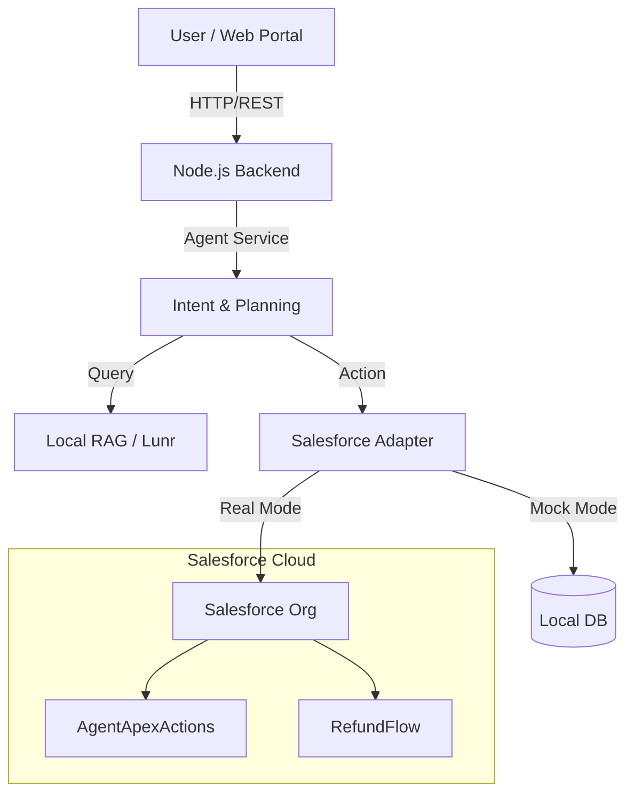

# Architecture

## High-Level Overview

This demonstrator simulates an Agentic Customer Support system integrated with Salesforce.

## Key Components

1. **Frontend (React)**: 
   - Chat Interface for user interaction.
   - Admin Dashboard for configuration and viewing mock data.

2. **Backend (Node.js/Express)**:
   - **AgentService**: Implements the `Reason -> Ground -> Act -> Verify` loop.
   - **RagService**: Uses `lunr` to index and search local markdown knowledge base.
   - **SalesforceAdapter**: Abstracts CRM operations. Switches between writing to local PostgreSQL (mock) and calling Salesforce API (real).

3. **Data Storage**:
   - **PostgreSQL**: Stores Mock Leads, Mock Cases, and Conversation History.

4. **Salesforce Artifacts**:
   - `AgentApexActions.cls`: Invocable Apex methods for validation logic.
   - `Flows`: Business process definitions (metadata).
